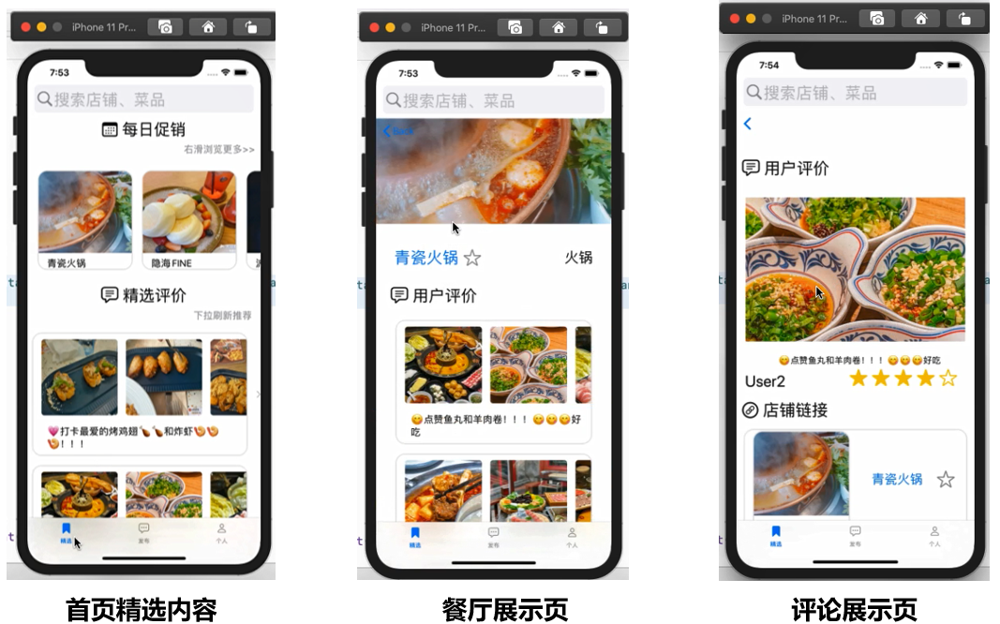
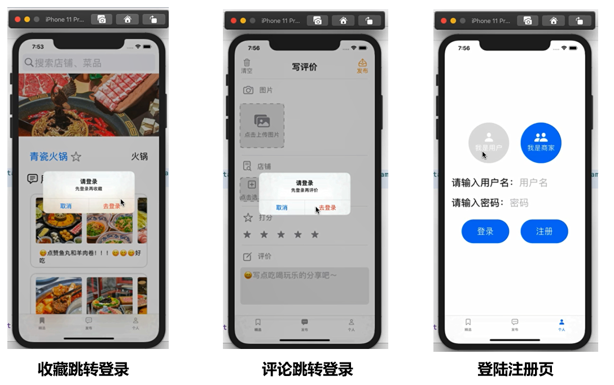
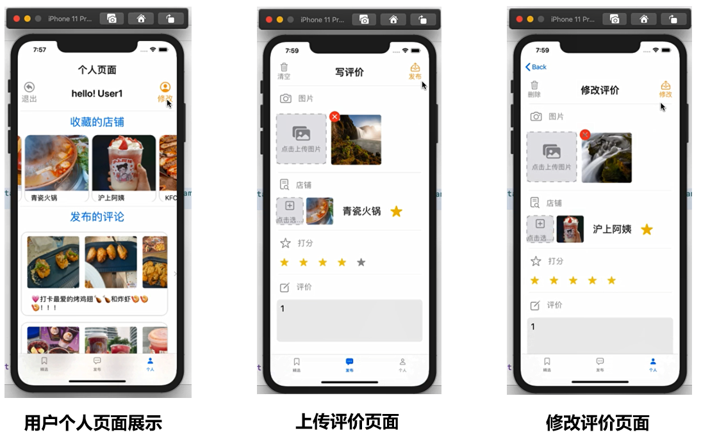
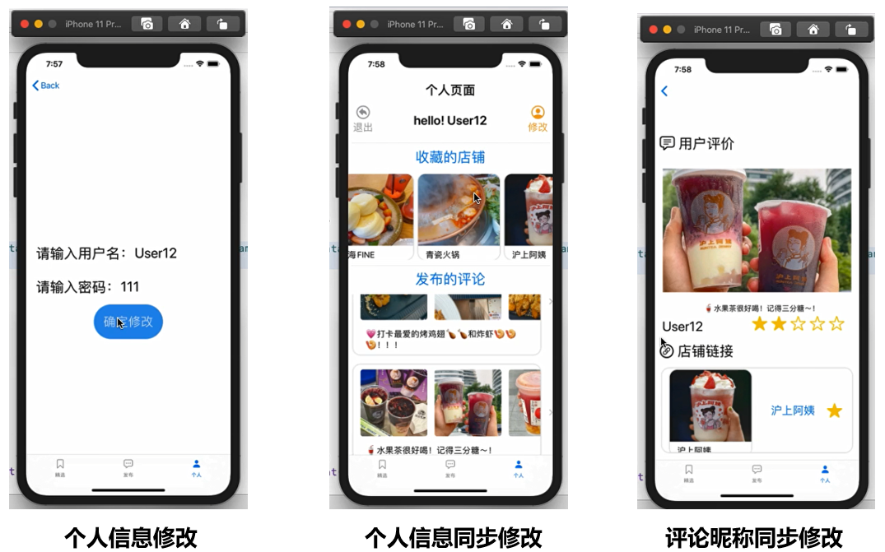
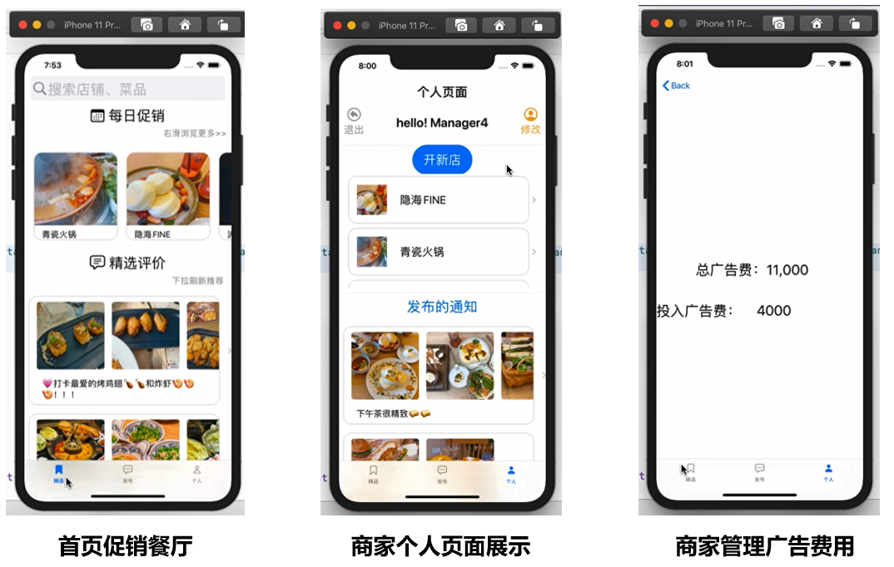

# SWIFT结课作业

## 一、项目简介

### 1.1 项目概述

本项目使用 **swift + swiftUI** 实现本 iOS App ，是一款对餐厅的展示与评价的 App，起名为《今天吃点啥》。

演示视频链接：https://www.bilibili.com/video/BV1ag411v7Su/?spm_id_from=333.999.0.0&vd_source=ffa61ec7eb779bcc4fa460ab11deca4c

### 1.2 项目版本介绍

虚拟机环境：macOS Catalina 10.15

XCode：11.4

**iOS simulator：iPhone 11 Pro**

### 1.3 运行本项目前的tips：

- 由于本项目在虚拟机上的执行环境最高为 **iPhone 11 Pro**，所以**前端UI的优化适配**的仿真器为 **iPhone 11 Pro**，烦请各位运行项目时注意**机型**的选择~
- 项目初始化数据中包含部分写好数据的账号，可以参见 `\res\userInfo.json`。这里推荐以下两个账号进行功能的展示：
  - 用户：【名称】User1;【密码】111
  - 商家：【名称】Manager4;【密码】111

## 二、功能设计

### 2.1 数据结构设计

#### 2.1.1 实体类型

从数据库的角度来说，本项目实现了三个实体，分别是：餐厅 (`Store`) 、评论 (`Comment`) 、用户 (`User`)，初始数据分别存储在 `store.json`、`comment.json`、`userInfo.json`。

后端数据从面向对象角度的设计：

- 用户 (`User`) 分为：商家 (`manager`) 和普通用户 (`user`) ，在数据权限方面有一定的区分
- 评论 (`Comment`) 分为：商家 (`manager`) 发布的通知 和普通用户 (`user`) 发布的评价

#### 2.1.2 数据结构设计

由于考虑到本项目数据量不大，并且swift提供很好的关于解析 json 的协议`Codable`，所以未使用数据库，而是使用 json 进行初始数据的序列化与用户运行时数据的持久化存储。
- 例如`user.json` -> `User.swift`使用 `Codable`协议时，要求json的字段名和结构体的字段名完全一致。

```swift
struct UserInfo: Hashable, Codable, Identifiable {
    var id: String
    var name: String
    var keyword: String
    var type: String
}
```

- 从文件目录解析json代码为结构体数组变量代码如下：

```swift
guard let file = Bundle.main.url(forResource: filename, withExtension: nil)
else {
	fatalError("Couldn't find \(filename) in main bundle.")
}
do {
	data = try Data(contentsOf: file)
} catch {
	fatalError("Couldn't load \(filename) from main bundle:\n\(error)")
}
do {
    let decoder = JSONDecoder()
    return try decoder.decode(T.self, from: data)
} catch {
    fatalError("Couldn't parse \(filename) as \(T.self):\n\(error)")
}
```

- `store.json` -> `Store.swift`的几点设计：
  - 使用 `Codable`协议必循遵守字段 `id`。同时在后端使用`id`作为查找标准，可以有效避免`name`同名问题。
  - 图片名使用`imageName`的字符串数组存储。图片复制进进工程目录即可
  - 用户对餐厅的收藏情况写在`staredUserId`字符串数组里，存储收藏用户的`id`。因为考虑到餐厅、评论都有可能被删除，如果在用户结构体里存储餐厅、评论的`id`，很有可能删除后所引导空指针。所以此处存储用户`id`，即使用户删除账号，此用户`id`数据作为垃圾数据即可，不会引发错误，因为删除账号的用户不会再次登录，这一条垃圾数据永远不会被访问到。
  - 真正的图片对象使用计算变变量来实现。`ImageStore.shared.image`是一个位于`\Model\Data.swift`的单例模式的字典，类似全局的图片加载库，每一个store变量只需要向其询问图片名，即可从字典中获得图片对象

```swift
struct Store: Hashable, Codable, Identifiable {
    var id: String
    var name: String
    var imageName: [String]
    var category: Category
    var manager:String
    var sumCost:Int
    var staredUserId: [String]
    var image: [Image] {
        var tmp = [Image]()
        for oneName in imageName {
            tmp.append(ImageStore.shared.image(name:oneName))
        }
        return tmp
    }
}
```

- `comment.json` -> `Comment.swift`的几点设计：
  - 写评论的用户`user_id`使用用户的id而不是用户名，是因为提供给用户修改名字的接口，如果用户修改名字后，会引发`comment`对`user`的访问空值错误。所以此处使用`user_id`。
  - 其余与`store.swift`的设计保持一致，不再赘述

```swift
struct Comment: Hashable, Codable, Identifiable {
    var id: String
    var store_id: String
    var user_id:String
    var rating:Int
    var context:String
    var commentImageName: [String]
    var commentImage: [Image] {
        var tmp = [Image]()
        for oneName in commentImageName {
            tmp.append(ImageStore.shared.image(name:oneName))
        }
        return tmp 
    }
}
```

### 2.2 页面设计

#### 2.2.1 首页页面1：精选展示



##### 模块1：每日促销

- 商家可以为自己所开的餐厅增加广告费投入，**广告费投入高的餐厅**会显示在**首页的每日促销**板块
- 可以左右滑动查看更多餐厅的缩略图卡片
- 点击餐厅的缩略图卡片，进入每个餐厅的展示页面

##### 模块2：精选评价

- 实现**下拉刷新的推荐**功能：如果用户多次点击某一类的评论，系统在用户下拉刷新后，会自动为其**推荐相同类型的评论**并置顶

- 可以上下滑动查看更多评论的缩略图卡片。此处展示所有用户对所有餐厅的评论
- 缩略图卡片支持展示评论的所有图片，可以左右滑动查看
- 点击评论的缩略图卡片，进入每个评论的展示页面

##### 模块3：搜索功能

- 输入搜索内容并回车，可以显示包含搜索内容的餐厅列表
- 可以上下滑动搜索结果，点击进入每个餐厅的展示页面

- 支持搜索菜品名：例如评论中出现的菜名，可以被视为检索内容，返还给用户其所属的餐厅链接
- 支持搜索餐厅类型：如果餐厅所属类型包含检索内容，会返还给用户该餐厅链接
- 支持搜索餐厅名：如果餐厅名字包含检索内容，会返还给用户该餐厅链接

#### 2.2.2 内容页面1：餐厅展示页

##### 模块1：餐厅信息

- 商家上传的餐厅图片，支持以**轮播图**的形式展示在页面上方
- 餐厅所属类型展示在右侧
- 支持用户点击按钮**收藏**该餐厅。如果用户未登录，会显示请**先登录再收藏**。用户可以选择**停留在此页面继续浏览**或者**跳转到第三个首页页面进行登录**。



##### 模块2：用户评价

- 可以上下滑动评论的缩略图卡片。此处展示所有用户对**此餐厅**的评论
- 缩略图卡片支持展示评论的所有图片，可以左右滑动查看
- 点击评论的缩略图卡片，进入每个评论的展示页面

#### 2.2.3 内容页面2：评论展示页



##### 模块1：用户评价

- 用户上传的用餐图片，支持以**轮播图**的形式展示在页面上方
- 以文本形式展示用户的名字、评价内容
- 以图标的形式展示用户的打分情况

##### 模块2：餐厅链接

- 餐厅缩略图卡片包含餐厅头图和餐厅名称
- 支持用户在缩略图卡片点击按钮**收藏**该餐厅。如果用户未登录，会显示请**先登录再收藏**。用户可以选择**停留在此页面继续浏览**或者**跳转到第三个首页页面进行登录**。
- 点击餐厅的缩略图卡片，进入餐厅的展示页面

#### 2.2.4 内容页面3：搜索结果展示页

- 搜索范围覆盖评论出现的菜品名、餐厅所属类型和餐厅名

- 以列表形式，展示所有包含搜索结果的餐厅链接。以餐厅缩略图(图片、名称)形式展示

#### 2.2.5 首页页面2：上传评价

##### 模块1：顶部功能栏按键

- 清空：可以删除当前用户编辑的所有内容
- 发布：发布评论。如果用户有未完成填写的内容，会提示用户继续完善。

##### 模块2：从相册上传图片

- 支持用户从相册上传多张图片
- 可以左右滑动查看所有照片
- 点击红色删除按键可以删除照片

##### 模块3：从餐厅列表选择一个餐厅写评价

- 可以上下滑动餐厅列表进行选择
- 选择餐厅后可以在此处进行收藏或取消收藏餐厅的操作
- 权限控制：如果是**商家**类型的账号，只能在此处选择**自己开设的餐厅**进行**通知的发布**

##### 模块4：打分和评价

- 支持点击五个星星按键选择打分
- 填写评价内容

#### 2.2.6 首页页面3：登陆注册页面

- 登录时需要提供正确的用户名和密码，可能出现的错误提示有：用户名不存在、密码错误
- 注册时需要使用正确的用户名注册，可能出现的错误提示有：用户名重复、用户名不能为空

#### 2.2.7 首页页面3：登录后的个人信息管理页面

##### 模块1：顶部功能栏按键



- 退出：可以退出当前账号的登陆，回到登陆注册页面
- 修改：修改用户的名称或密码。对于名称的修改，会同步到个人页面的名称信息，以及用户发布的评论展示页面的名称显示

##### 模块2：【用户账号】收藏的餐厅


- 用户在其他页面对餐厅是否收藏的修改，会动态的同步到此模块
- 可以左右滑动查看更多已收藏餐厅的缩略图卡片
- 点击餐厅的缩略图卡片，进入每个餐厅的展示页面

##### 模块3：【用户账号】发布的评论

- 可以上下滑动查看更多评论的缩略图卡片。此处展示**此用户的所有评论**
- 缩略图卡片支持展示评论的所有图片，可以左右滑动查看
- 点击评论的缩略图卡片，进入每个评论的**修改页面**。用户只能修改自己的评论。

##### 模块4：【商家账号】开设的餐厅



- 提供开店接口，商家可以开设新店

- 以 list列表的形式，显示餐厅的缩略图（图片、名字），允许商家点击进行广告费用的管理。广告费高的商家会出现在首页的推荐栏中

##### 模块5：【商家账号】发布的通知

- 商家可以修改自己发布的所有通知，与用户对评论的管理类似

## 三、核心功能代码实现

#### 3.1 从相册上传图片——尾随闭包的学习

`\Views\PageView1.swift`文件里的`struct ImagePicker`结构体承担了选择图片的View设计。

- 它在父视图中由一个状态量`@State var showCameraPicker = false`控制，当其为真时，弹出一个sheet表单。表单的视图就是`ImagePicker`.
- 父视图使用ImagePicker时，有一个尾随闭包，接受ImagePicker传递给它的image参数，类似返回值的概念

```swift
Button(
	action: { showCameraPicker = true },
    label:{ ... } )
.sheet(isPresented: self.$showCameraPicker,content:
       { ImagePicker( ... ) { image in
			self.getUIImage.append(image)
       }
})
```

- ImagePicker结构体部分：
  - `presentationMode`变量，控制此视图消失。用户选择图片后调用`presentationMode.dismiss()`关闭此页面
  - 关闭页面前，调用`onImagePicked(uiImage)`把子视图获取到的数据数据返回给父视图

```swift
struct ImagePicker: UIViewControllerRepresentable {
    @Environment(\.presentationMode) private var presentationMode
    let onImagePicked: (UIImage) -> Void
    //...
    
    func imagePickerController( ... ) {
        //...
        onImagePicked(uiImage)
        presentationMode.dismiss()
    }
    
    //...
}
```

这样父视图和子视图通过**尾随闭包**实现了数据的传递，这是我在此次大作业中关键的收获之一。之前学习swift尾随闭包时觉得很抽象不好理解，通过大作业的学习让我熟练运用尾随闭包进行**子视图对父视图数据**的自由传递。

其实从相册选择图片`struct ImagePicker`是我查找资料学习到的代码，代码使用了很多内置的控制器和协议，对我这这初学者来说比较难理解。但是我从中学习抽象到了这个向父视图传递数据的尾随闭包写法，让我在大作业的完成中多次实践了尾随闭包，例如此文件中上传评价页面的选择餐厅功能，就是我把餐厅列表写进sheet中作为子视图，通过尾随闭包向父视图传递了所选的餐厅数据。`struct ChooseView`结构体就是这个子视图。


#### 3.2 下拉刷新推荐

在之前的iOS开发实践作业中，从storyboard学习到了一个下拉刷新的部件，与我的app主题很匹配，所以在大作业中很尝试一下。由于我使用的是swiftUI，并且我所使用的版本没有像storyboard中提供了对下拉刷新部件的原生支持，所以这里的刷新UI经过查找资料后写在了`\Views\refreshView.swift`里。这个过程还是比较痛苦的，因为我的虚拟机版本不太适合一些开源库，所以只能手搓下拉刷新板子 :( 。并且资料还存在一些bug，所以经过大量调试后才有了现在的下拉刷新UI。可能这个View里的代码存在部分冗余，如果各位有更好的swiftIUI的写法欢迎各位与我交流 :)

下面主要介绍下拉刷新的后端实现机制。由于我给每个餐厅都设置了一个category字段，所以用户点击评论时，我可以获取到评论关联到的餐厅，获取到它的category类型。给全局的字典`[Category:Int]`代表的此类category的click次数加一。每次下拉刷新的时候重新按category的click次数排列评论即可实现推荐功能。

具体类似”全局变量“的实现机制如下，主要依靠了`@EnvironmentObject`类型：

- 在`\Models\UserIndo.swift`里有一个`final class UserData: ObservableObject `
- 在其他视图声明`@EnvironmentObject var userData: UserData`
- 在创建根视图时传递参数`UserData()`

#### 3.3 数据与图片的持久化存储

一开始定下了使用json就是想实现数据的持久化存储。后来发现把 iOS App 当成之前python开发写了，还想着改项目工程的本地文件呢，后来发现这是行不通的，所以查阅了ios App不适用数据库的数据持久化写法，发现了可以使用iOS App的沙盒机制来存储。

> 沙盒（sandbox）是 iOS 的一个防御机制，每个应用都有一个属于自己的沙盒。应用只能在自己的沙盒目录下读写数据，应用 A 不能访问应用 B 的沙盒，它们之间是互相隔离的。

沙盒目录下有三个文件夹Documents、Library（有Caches和Preferences目录）、tmp。

我选择把数据写在Documents文件夹下，可以用来持久化数据，原因是苹果建议将例如文件数据等在应用程序中浏览到的文件数据保存在该目录下，低存储、程序退出都不会删除数据，且iTunes会备份。

主要的实现机制如下：

- 每次向`final class UserData: ObservableObject`的数据实体（store user comment）集合**写数据**时，例如注册、评论的增删改、创建店铺、用户收藏等等，都把这三个结构体集合重新序列化为json，只不过我们从本地读初始化json，向沙盒中写入新的json。
- 除去app初始化时从本地读json以外，可以通过判断沙盒中是否有这个json文件，来决定从哪里读取json。除去第一次运行时，沙盒中没有json数据要从本地读，以后每次运行时都从沙盒中读取修改更新后的json数据，就可以做到数据的持久化存储。
- 图片的处理流程与json文件基本一致，只不过需要分开文件类型存储，文件名依然需要写进json。以下为代码部分：

```swift
//获取沙盒Document文件夹路径
func getDocumentsDirectory() -> URL {
    let paths = FileManager.default.urls(for: .documentDirectory, in: .userDomainMask)
    return paths[0]
}

//从沙盒读图片
func getImageFromCache(filename:String){
    let filename = getDocumentsDirectory().appendingPathComponent("\(filename).jpg")
    let imgData = try! Data.init(contentsOf: filename)
    let t = UIImage(data: imgData)!
    self.getImage.append(Image(uiImage: t))
}

//向沙盒写图片
func loadImageInToCache(str:String, uploadImg:UIImage){
    let filename = getDocumentsDirectory().appendingPathComponent(str)
    if let data = uploadImg.jpegData(compressionQuality: 0.8) {
        try? data.write(to: filename)
    }
}

//上传comment
func upload(){
    let i = userData.comments.count

    //把图片重新命名，写进commentName字符串集合
    //把图片写进沙盒
    var k = [String]()
    for index in 0..<getUIImage.count {
        let picStr = "c00\(i+1)_\(index+1).jpg"
        loadImageInToCache(str:picStr, uploadImg:self.getUIImage[index])
        k.append("c00\(i+1)_\(index+1)")
    }
    
    //新的comment结构体插入全局单例模式UserData
    let c = Comment(id:"c00\(i+1)",store_id: commentStore.id, user_name: self.userId, rating: rates, context: self.text1, commentImageName: k)
    self.userData.comments.insert(c, at: 0)

    //把更新后的json写进沙盒
    let encoder = JSONEncoder()
    do  {
        let data: Data = try encoder.encode(self.userData.comments)
        let filename = getDocumentsDirectory().appendingPathComponent("comment.json")
        try? data.write(to: filename)
    } catch {
    }
}
```

#### 3.5 面向对象与代码复用

可以看到页面一和页面三的部分模块的布局还是比较像的，以及餐厅展示页面和评论展示页面也比较像，还有添加评论和修改评论的页面也比较相似。这些页面的View 结构体的代码复用率较高，例如不同模块的评论卡片展示只需要对传入的数据集合做一些filter、sort等操作即可。

## 四、改进建议

1. 对于mac的环境还不是非常熟悉，所以并未采用部分成熟的开源库。后续可以考虑对于**TextField、scrollView 等部件**使用**更加成熟的开源**库，进行功能与外观的进一步优化。
2. 对于后端数据，已经学会可以使用面向对象的重载继承等特性；而对于前端实现 View Delegate 的 struct 结构体，尽管在本项目中实现了其大部分的**代码复用**，但对于部分场景下，如何将**面向对象思想应用在前端的数据结构**，还需要进一步学习探索。

3. 由于本项目的环境为 macOS Catalina 10.15 + XCode：11.4，所以在写代码时，发现一些高版本的写法与特性，在 XCode11.4 并不适配，编译器会进行报错。所以可能部分代码的写法存在一定冗余，望各位包涵~

> 以下列举本app在功能方面由于时间原因仍未完善的功能：

4. 枚举类型的自定义
5. 设置用户头像
6. 评论关联到用户信息页面
7. 对评论的点赞（与餐厅的收藏机制几乎一致）

8. 增加时间系统

## 五、swift课程的学习感受

初学swift还是有些门槛的，比如XCode的编译器报错实在太严格了，等号两端空格要相等，等号和附属之间必须有空格，还有一开始iOS App开发的实践作业，由于我的虚拟机版本有一些不同，在如何让代码正确地在XCode上跑起来，都是一件很难或者说很幸福的事了。不过写完这次大作业，我也意识到，正是由于XCode非常严格的报错或者警告机制，才让我几乎很少在后端方面debug，可以说严格的编译器极大程度地从源头上减少了我在编码时的bug，所以写到现在还是很喜欢XCode这个报错机制的hhhh

再比如一开始接触swiftUI的时候觉得很头大，因为版本更迭很快，查资料非常痛苦，别人能跑通的代码，到我这个版本的XCode编译器经常报错说，这个部件你不能用，那种写法不对。或者说正是因为这种快速迭代，确实swiftUI没有很系统的资料，学习起来也比较困难。

后来一边写大作业的时候，我尝试着从一些能跑通的源码里阅读理解，比如搞懂了前面提到的尾随闭包、沙盒机制、@EnvironmentObject机制、@State、@Binding等等非常优雅非常高效的开发机制，让我感觉swiftUI确实非常适合敏捷开发，可能我作为swift入门不久的初学者，会使用的技巧还很有限，但是我已经能在不长的的时间里完成一个在我眼中完成度还比较高的App，成就感还是比较大的 :) 

也可能正是swiftUI版本迭代的快速，让它在初学门槛高的同时，最大程度地提供给开发者各类高效优雅的接口、模式等等。总而言之学完swift课程，写完swift大作业，我还是挺喜欢swift语言也挺喜欢swift课程的\~日后不忙的时候我也会尽量再学习一些iOS开发技巧，把上面给自己提的建议再进一步完善\~

